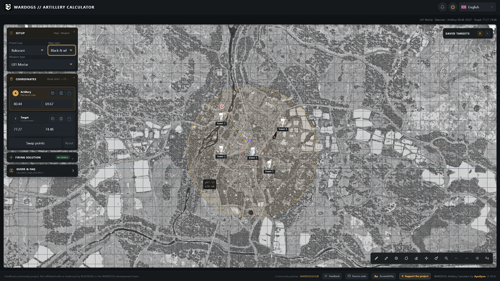
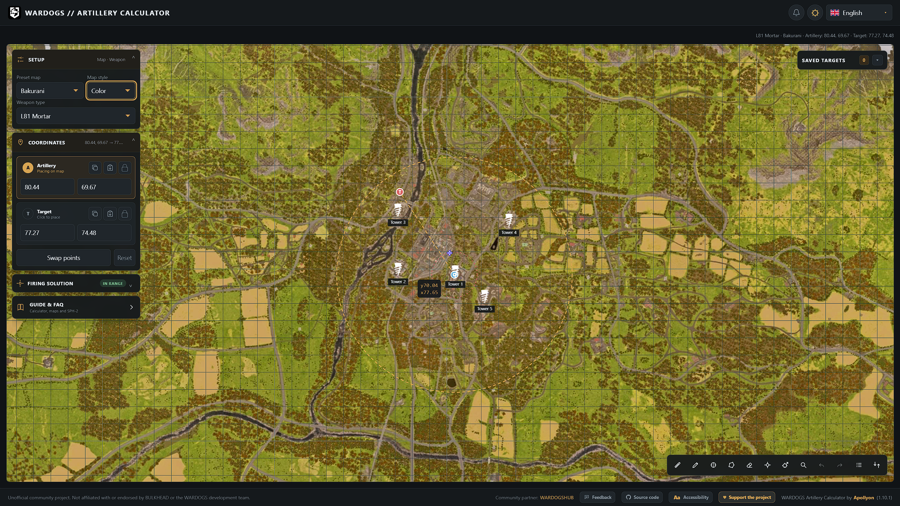

# <ins>Unofficial WARDOGS Offline Calculator!</ins>

A dedicated open-source, community-based, desktop __mortar__ and __artillery__ calculator for __WARDOGS__.  
Thanks for checking out my 100% offline WARDOGS mortar/artillery calculator port!

Original Credit to *__@apollyon-sys__*

__*Please note that the initial [install.exe](https://github.com/RealxAlucard/WARDOGS-Artillery-Calculator---Offline/blob/main/wardogs-offline-installer-v5.exe) takes up <ins>~2GB</ins>. However, the calculator takes up <ins>~270MB</ins> of space on a storage drive <ins>!!See below!!</ins>*__

# Installation
    1. To install the calculator, simply download the [Setup Installer] "wardgos-offline-installer-v5.exe" and run it.
    2. This will prompt you with an installer and simply choose where you want to install to.
    3. After installation, navigate to the "...\WARDOGS Artillery Calculator\" folder that has the "WARDOGS Calculator - Offline.exe" and double click to run.
    4. (2) Things will occur: 
        1. The installer will do an initial tile map setup and *Ta-da* *[For First Time Installs]*
        2. It'll work.
    5. Delete Setup.exe after installation and enjoy.

---

# Interface

| Black/White |
| --- |
|  |

| Color |
| --- |
|  |
